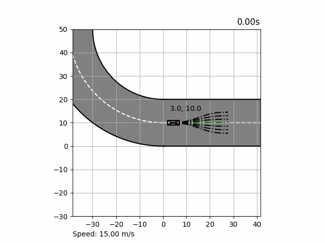

# Motion Planning Project

[](https://github.com/earasteh/Python-Motionplanning/actions/workflows/build.yml)


## Abstract
This project is using a conformal lattice planner to generate paths for the vehicle to follow. The vehicle uses a 
Stanley controller for its lateral control tracking a PID controller for its longitudinal control. 
The vehicle model is 7 DoF planar bicycle model with Pacjeka tire models and algebraic normal forces.

<div align="center">
	
</div>

Added features:
- Conformal Lattice Planner
- A 7 DoF vehicle model with Pacejka magic tire formula with algebraic normal forces
- Longitudinal PID controller
- Stanley Control for lateral tracking
- 4th-Order Runge-Kutta (RK4) is added for the integration of the vehicle model instead of Euler
- Multiprocessing added to speed up the collision checking process (the algorithm can still be further improved)

The animation part of this project is taken from https://github.com/winstxnhdw/KinematicBicycleModel 
and the motion planning and controller part is taken from Coursera's class on motion planning.

To Do:
- Motion controllers need more tuning (not working in a higher speeds due to limitations of decoupled controllers)
- Change the tracker to MPC
Optional:
- Change RK4 to scipy.odeint which uses FORTRAN and is faster
- Animation can be moved to pygame

## Advantages
- The motion controllers and motion planner is easy to implement in real scenarios
- This platform can be used for developing and testing further motion planning and motion control problems
- The lattice planner can be modified to include other cost functions
## Limitations
- The controllers are unaware of nonlinear tire saturations and limiations. This will drive the vehicle to unstable 
situations which can not be recovered from
- The controllers and conformal lattice planner both have a lot of tuning parameters which can be hard to tune sometimes


## Requirements
Numpy, pandas, scipy, multiprocessing
## Demo

Install the requirements

```bash
pip install -r requirements.txt
```

Play the animation

```bash
python animation.py
```

## Folder structure
```bash
├── animate.py
├── data
│   ├── waypoints.csv
├── libs
│   ├── controllers
│   │   └── stanley_controller.py
│   ├── motionplanner
│   │   ├── collision_checker.py
│   │   ├── local_planner.py
│   │   ├── path_optimizer.py
│   │   └── velocity_planner.py
│   └── utils
│       ├── car_description.py
│       ├── cubic_spline_interpolator.py
│       ├── env.py
│       ├── normalise_angle.py
│       ├── plots.py
├── README.md
├── requirements.txt
├── resources
│   └── animation.gif
└── vehicle_model.py
```

## Concepts
- Conformal Lattice Planner
- Planar vehicle model
- Stanley Controller as a lateral control
- Longitudinal Controller